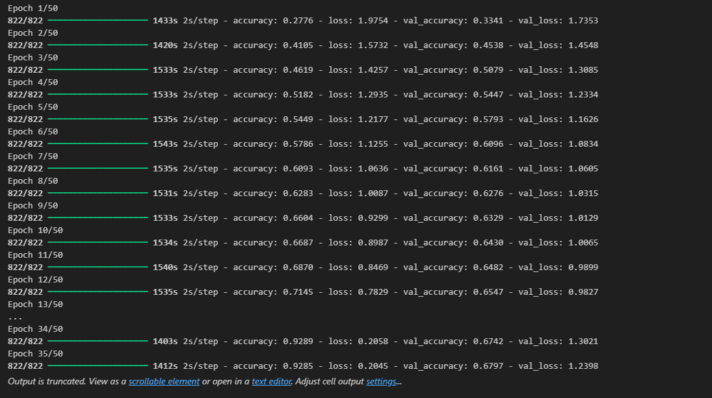
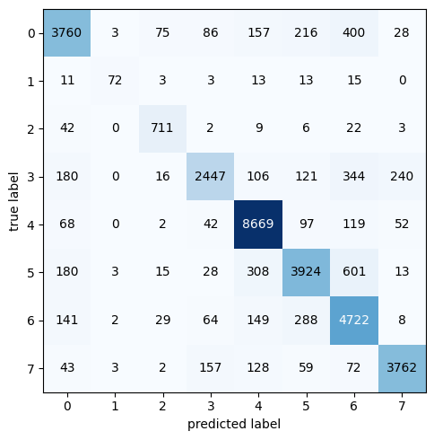
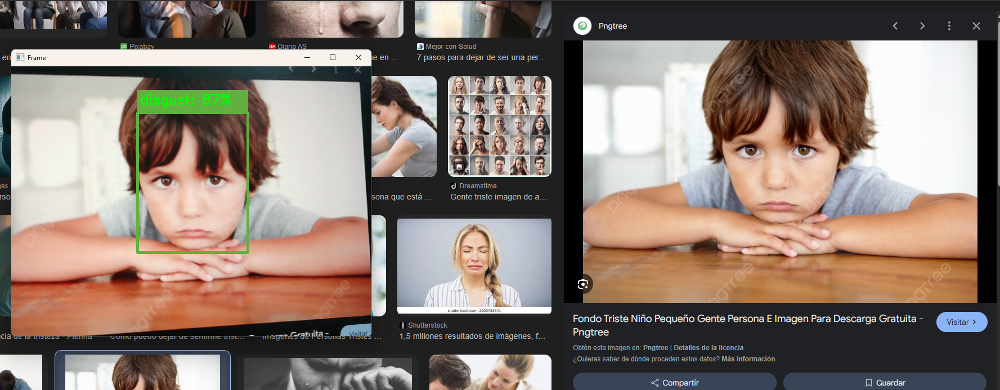

# 👁️ Clasificación de Emociones con Visión por Computadora

## 📄 Descripción del Proyecto
Este proyecto implementa un sistema de clasificación de emociones basado en **visión por computadora** utilizando **Redes Neuronales Convolucionales (CNNs)**.  
El modelo analiza imágenes faciales y clasifica cada una en una de las siguientes ocho emociones:

> `['sadness', 'happiness', 'fear', 'neutrality', 'surprise', 'anger', 'disgust', 'contempt']`

El sistema está optimizado para funcionar en **tiempo real** a través de una cámara web, lo que lo hace aplicable en:
- Interacción humano-computadora  
- Psicología computacional  
- Análisis de comportamiento  

> 💡 Proyecto desarrollado en el marco del **Bootcamp de Inteligencia Artificial nivel intermedio** del **Ministerio de Tecnologías de la Información y las Comunicaciones**.

---

## ✨ Características

- **Clasificación de 8 emociones** humanas.  
- **Entrenamiento con imágenes** de 224×224 píxeles en escala de grises.
  
- **Procesamiento en tiempo real** mediante cámara web.  
- **Detección facial con modelo preentrenado SSD (Caffe)**.  
- **Arquitectura CNN optimizada** para reconocimiento facial.  
- **Evaluación con matriz de confusión** y reporte de clasificación.
  
  

  
| Clase | Precision | Recall | F1-Score | Support |
|-------|-----------|--------|----------|---------|
| sadness     | 0.8497    | 0.7958 | 0.8219   | 4725    |
| happiness     | 0.8675    | 0.5538 | 0.6761   | 130     |
| fear    | 0.8335    | 0.8943 | 0.8629   | 795     |
| neutrality    | 0.8650    | 0.7085 | 0.7789   | 3454    |
| surprise    | 0.9088    | 0.9580 | 0.9328   | 9049    |
| anger     | 0.8307    | 0.7737 | 0.8011   | 5072    |
| disgust    | 0.7501    | 0.8740 | 0.8073   | 5403    |
| contempt   | 0.9162    | 0.8902 | 0.9030   | 4226    |
| **Accuracy**   |           |        | **0.8543** | 32854  |
| **Macro Avg**  | 0.8527    | 0.8060 | 0.8230   | 32854  |
| **Weighted Avg** | 0.8565  | 0.8543 | 0.8532   | 32854  |

---

## 📂 Dataset y Procesamiento de Datos

- **Resolución de entrada:** 224×224 píxeles.  
- **Color:** Escala de grises (`color_mode='grayscale'`).  
- **Tamaño de batch:** 50.  
- **División de datos:** 80% entrenamiento / 20% prueba.  
- **Preprocesamiento:** Generación con `ImageDataGenerator` de Keras.  

---

## 🏗️ Arquitectura del Modelo

El modelo es una **CNN secuencial** con la siguiente configuración:

| Bloque | Capa | Parámetros | Activación | Observaciones |
|--------|------|------------|------------|--------------|
| 1 | Conv2D | 32 filtros (3×3) | ReLU | BatchNorm + MaxPooling (2×2) + Dropout(0.2) |
| 2 | Conv2D | 64 filtros (5×5) | ReLU | BatchNorm + MaxPooling (2×2) + Dropout(0.2) |
| 3 | Conv2D | 128 filtros (3×3) | ReLU | BatchNorm + MaxPooling (2×2) + Dropout(0.2) |
| 4 | Conv2D | 256 filtros (3×3) | ReLU | BatchNorm + MaxPooling (2×2) + Dropout(0.2) |
| 5 | Conv2D | 512 filtros (3×3) | ReLU | BatchNorm + MaxPooling (2×2) + Dropout(0.2) |
| 6 | Flatten | — | — | — |
| 7 | Dense | 128 neuronas | ReLU | BatchNorm + Dropout(0.2) |
| 8 | Dense | 256 neuronas | ReLU | BatchNorm + Dropout(0.2) |
| 9 | Dense | 8 neuronas | Softmax | Salida: 8 clases |

---

## ⚙️ Entrenamiento

- **Optimización:** Adam (`learning_rate=1e-4`)  
- **Pérdida:** `categorical_crossentropy`  
- **Métrica principal:** `accuracy`  
- **Épocas:** 50 (con `EarlyStopping` paciencia=20)  
- **Callbacks:**
  - `EarlyStopping` → evita sobreajuste.  
  - `ModelCheckpoint` → guarda el mejor modelo.  
  - `TensorBoard` → registro de métricas.  

---

## 🎥 Uso en Tiempo Real con Cámara Web

La aplicación final combina **detección de rostros** con el **clasificador de emociones** para procesar video en vivo:

1. **Detección de rostro**:
   - Modelo: `res10_300x300_ssd_iter_140000.caffemodel` (SSD de OpenCV con Caffe).
   - Configuración: utiliza el archivo `deploy.prototxt` para definir la arquitectura.
   
2. **Clasificación de emociones**:
   - Modelo entrenado: `model_1_224.keras`.
   - Preprocesamiento: conversión a escala de grises, redimensionado a 224×224, normalización.
   
3. **Visualización en tiempo real**:
   - Se dibuja un rectángulo alrededor del rostro detectado.
   - Se muestra la emoción predicha y la probabilidad.
   - Se calcula y muestra el **FPS** (frames por segundo) para monitorear rendimiento.

**Flujo general**:

---

## 📊 Resultados y Evaluación

- **Evaluación en set de prueba:** precisión global obtenida durante la validación.  
- **Matriz de confusión:** para analizar el rendimiento por clase.  
- **Reporte de clasificación:** métricas `precision`, `recall` y `f1-score` por cada emoción.  
  
  
---

## 🛠️ Tecnologías Utilizadas

**Lenguaje:**  
- Python 3.11  

**Librerías principales:**  
- **TensorFlow / Keras** → desarrollo y entrenamiento de la CNN  
- **OpenCV** → procesamiento de imágenes y captura de cámara web  
- **NumPy** → operaciones numéricas  
- **Pandas** → manejo de datos  
- **Matplotlib** → visualización  
- **scikit-learn** → métricas y evaluación  
- **mlxtend** → visualización de matriz de confusión  

---

## 📬 Contacto

**Miguel Ángel García Cañón**  
📧 Email: [miggarciacan@gmail.com](mailto:miggarciacan@gmail.com)  
🔗 LinkedIn: [Perfil Profesional](https://www.linkedin.com/in/miguel-angel-garcia-561595210/)  
💻 GitHub: [miggarc98](https://github.com/miggarc98)
